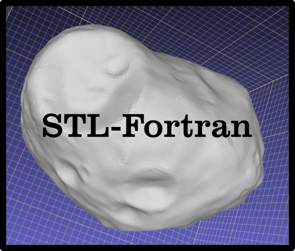

============

### Brief description

Fortran code for reading and writing STL (STereoLithography) files.

### Status

[](https://github.com/jacobwilliams/stl-fortran/releases/latest)
[](https://github.com/jacobwilliams/stl-fortran/actions)
[](https://codecov.io/gh/jacobwilliams/stl-fortran)
[](https://github.com/jacobwilliams/stl-fortran/commits/master)

### Example

```fortran
  program main

  use,intrinsic :: iso_fortran_env, only: wp => real64
  use stl_module

  implicit none

  type(stl_file) :: model
  integer :: istat !! status return code

  ! add a sphere:
  call model%add_sphere([0.0_wp, 0.0_wp, 0.0_wp], 1.0_wp, 20, 40)
  call model%write_binary_stl_file('sphere.stl',istat)

  end program main
```

### Compiling

A [Fortran Package Manager](https://github.com/fortran-lang/fpm) manifest file is included, so that the library and test cases can be compiled with FPM. For example:

```
fpm build --profile release
fpm test --profile release
```

To use `stl-fortran` within your fpm project, add the following to your `fpm.toml` file:
```toml
[dependencies]
stl-fortran = { git="https://github.com/jacobwilliams/stl-fortran.git" }
```

To generate the documentation using [FORD](https://github.com/Fortran-FOSS-Programmers/ford), run: ```ford stl-fortran.md```

### License

The stl-fortran source code and related files and documentation are distributed under a permissive free software [license](https://github.com/jacobwilliams/stl-fortran/blob/master/LICENSE.txt) (BSD-style).

### Documentation

The latest API documentation can be found [here](https://jacobwilliams.github.io/stl-fortran/). This was generated from the source code using [FORD](https://github.com/Fortran-FOSS-Programmers/ford).

### See also

  * [FOSSIL, FOrtran Stereo (si) Lithography parser](https://github.com/szaghi/FOSSIL)

### Reference

  * https://en.wikipedia.org/wiki/STL_(file_format)
